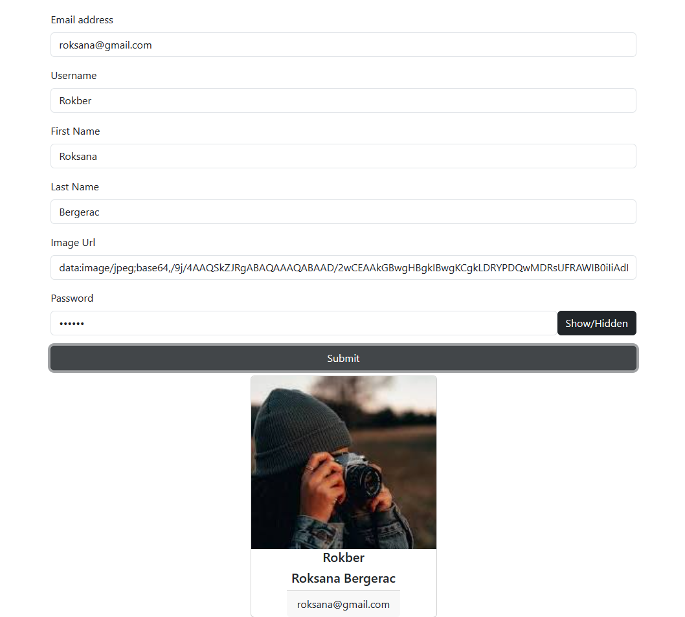

# Moving Button
This project is a simple website created using React and React-Bootstrap.
## Screenshots
 

[Moving Button Live Page](https://moving-button-esma.netlify.app/)
## How to use?
If not all fields in the form are filled, the "Submit" button will move when hovered over. 
By clicking on the "Show/Hidden" button next to the "Password" field, you can hide or reveal the password. 
If you enter the information and save, you will encounter a card structure. 
## Tech/framework used

<b>Built with</b>  
 
 
## Description
In the project directory, you can run:
### `npm start`
Runs the app in the development mode.\
Open [http://localhost:3000](http://localhost:3000) to view it in your browser.

 
